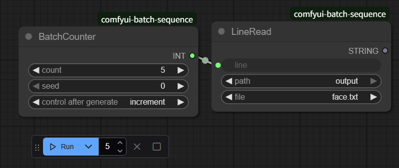

# ComfyUI Batch Sequence Node
このカスタムノードは、**ComfyUIでのバッチ処理（連続した画像生成など）をよりスムーズに行う**

ためのツールキットです。

This custom node is a toolkit designed to help you run **batch processing (such as sequential**

**image generation) more smoothly in ComfyUI.**

## BatchCounter

0,1,2,3,... Batch Count分 INT を出力します

Output an integer sequence from 0 up to the number of batches (Batch Count).

- count

    **Batch Count に指定した値と同じ物を指定**

    ++Set the value to match the Batch Count.**

- seed

    必ずバッチ開始時は 0 に指定してください

    Always set the batch start index to 0.

- control after generate

    **increment 以外指定しないでください**

    **Please specify only "increment."**

## ReadLine

指定テキストファイルの該当行のテキストを抽出します。

Extracts the text string from the specified line of a given text file.

- line
    読み込む行の指定、先頭は0から

    The specified line number (index) is zero-based.

- path

    読み込みルートパスの選択(input,output)

    Input Path Selection (Options: Input or Output)

    - input

        ComfyUI インプットフォルダ

        ComfyUI Input Directory

    - output

        ComfyUI アウトプットフォルダ

        ComfyUI Output Directory

- file

    読み込みファイルを指定

    Specify the file to read.

---

**[YokoYoko TEC.](https://note.com/alive_gibbon2712)**

